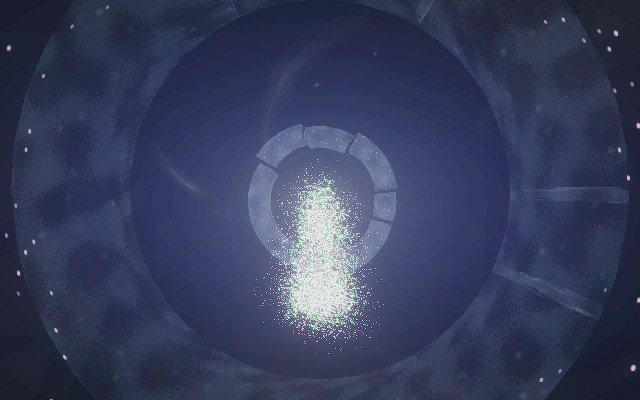
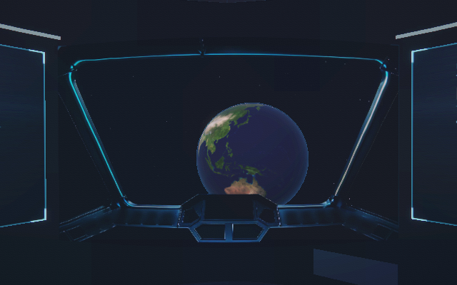
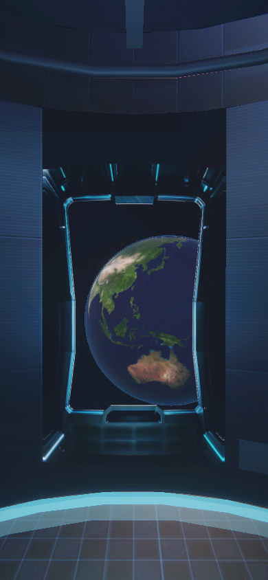

# Rocket r7: проверка мира VPN и безопасный перенос кода

Статус: r7 опубликован на сервере клиента 8 сентября 2026. Исходники: локальный коммит `c05b1acb3261a27b8ecd38a7b7dff5c2c1310abc`; отправка коммита в GitHub заблокирована отдельно от публикации сайтов.

## Две ошибки графики

1. В r6 была пропущена собственная генерация отражений в `rv-корабль.js`. Она продолжала запускать PMREM с HalfFloat на неподдерживающем устройстве. Расширенный нативный рендер воспроизвёл ошибки текстуры и framebuffer. Теперь этот путь проверяет возможность рисования в HalfFloat; при её отсутствии сохраняется прямое освещение.
2. Поле колец в `rv-труба.js` использовало `dFdx/dFdy` без включения `OES_standard_derivatives`. Реальная компиляция WebGL 1 выдала `extension is disabled`, а программа не запускалась. Материал теперь запрашивает расширение; для реализации без него предусмотрена фиксированная ширина сглаживания. В WebGL 2 используются встроенные производные.

## Решение без BrowserStack

`review/native-world.cjs` расширяет прежний рендер одной кабины. Он загружает исходные Three r160, мир, управление прокруткой и шесть актов VPN. Входные размеры секций берутся из высот `svh` в `frame.html`. Камеру перемещает настоящий код сайта. Перед каждым снимком прокрутка доходит до заданной точки.

| Формат | Контрольные точки | Результат |
|---|---:|---|
| 640×400 | 6 актов × 3 точки × 2 направления = 36 | 0 ошибок GL, шейдеров, событий и актов |
| 390×844 | 6 актов × 3 точки × 2 направления = 36 | 0 ошибок GL, шейдеров, событий и актов |

Проверяемые доли каждого акта: 0.05, 0.50, 0.95. Для каждого кадра сохранены изображение, SHA256, координаты и ориентация камеры, число цветов, видимые акты и счётчики ресурсов. В JSON также записаны контрольные суммы загруженных модулей. Все 72 кадра непустые: минимум 8538 различных цветов на широком формате и 11158 на портретном.

Файлы: `review/native-world-r7/desktop/` и `review/native-world-r7/portrait/`. `lastRenderPass` описывает последний проход композитинга, а не суммарную нагрузку всей сцены.

Примеры:







Это **покадровая проверка выбранных точек, не непрерывная браузерная приёмка**. Между точками логика выполняется с модельным шагом времени; промежуточные кадры не рисуются. Стенд не воспроизводит HTML-текст, кнопки, раскладку CSS, аудио, игровой полёт и особенности конкретного телефона. Он не измеряет реальный FPS и не проверяет HDR/WebGL 2. Сходство с Igloo 1:1 и фотореализм по этому результату не подтверждаются.

Во время разработки стенда обнаружились его собственные ошибки: исключение одного обработчика события останавливало остальные обработчики, а счётчик команд отражал только последний проход. Это исправлено в стенде, а не записано как ошибка сайта. Модуль HTML-окна `rv-внутрь.js` исключён из нативной проверки вместе с остальным DOM-интерфейсом.

В Linux с доступным X display и зависимостями `gl@8.1.6`, `@napi-rs/canvas@0.1.80`:

```sh
ROCKET_GL_DEBUG=1 node review/native-world.cjs rocketvpn /tmp/rocket-world 640 400 all
```

## Что с видеокартой

Повторная проверка служебного сервера подтвердила RTX PRO 6000 Blackwell Server Edition с 97887 MiB памяти и `NVIDIA_DRIVER_CAPABILITIES=compute,utility`. Это доступ для вычислений и мониторинга. Для OpenGL/EGL/Vulkan NVIDIA отдельно требует `graphics`; сам GPU-сервер также не подключает видеокарту к браузеру текущей сессии. См. [документацию NVIDIA](https://docs.nvidia.com/datacenter/cloud-native/container-toolkit/latest/docker-specialized.html).

Поэтому фраза «видеокарты нет» была бы неверной. Ограничен графический доступ из конкретного окружения. Все новые кадры r7 получены локально через нативный WebGL 1; аппаратное ускорение NVIDIA и производительность телефонов этим не подтверждаются. Дополнительная GPU-машина не арендовалась, общий работающий сервер не перезапускался. Ранее отклонённая передача закрытого кода на GPU не повторялась.

## Замечание о ветке

Самостоятельный снимок выпуска нельзя переносить целиком поверх монорепозитория. Это теперь явно написано первым пунктом README. Добавлены `deploy/integrate.py`, список `deploy/rocket-overlay.json` и `INTEGRATION.md`. Перенос охватывает 58 файлов Rocket: 39 изменений и 19 добавлений относительно исходной Rocket-ветки. Удалений нет. Все существующие документы, старые проверки и другие проекты сохраняются. При конфликте инструмент останавливается до записи.

Шесть проверок интеграции проходят. Основной JavaScript-набор: 46 проверок без ошибок. Изолированный API-набор также прошёл. Исходная Rocket-ветка и `main` не изменялись.

## Публикация

Пакет меняет только два производственных файла VPN. Перед переключением сверяются 21 файл обоих сайтов. Данные и API этим выпуском не меняются; подготовлен отдельный каталог r7 с откатом на r6.

После переключения **27/27 серверных проверок прошли**, все пять ранее существовавших заявок сохранены. Активный каталог: `/var/www/rocket-releases/20260908-r7`. Предыдущий r6 сохранён. Адрес VPN: https://rocketvpn.top/.

```sh
sudo python3 /var/www/rocket-releases/20260908-r7/deploy/followup.py health
sudo python3 /var/www/rocket-releases/20260908-r7/deploy/followup.py rollback
```

Вторая команда выполняется только при необходимости отката к r6; при проверке выпуска она не запускалась.

## Отдельная блокировка GitHub

Автоматическая проверка отклонила push в существующую ветку `gdeoko/OKO-TEAM:codex/rocket-recovery-20260908-clean`. Затем проверены адрес репозитория, SHA существующей ветки и все 86 файлов коммита: 72 PNG, 14 файлов кода, метаданных и отчётов. Сканирование распространённых форматов ключей совпадений не нашло; такая проверка не является универсальным доказательством отсутствия секретов.

Повторная проверка всё равно отклонила отправку: существование репозитория и ветки не признано достаточным подтверждением доверенного получателя непубличного кода и артефактов. Для GitHub требуется отдельное явное разрешение на этот пакет и этот адрес. Отправка другим инструментом не выполнялась.

Публикация на уже разрешённом сервере клиента выполнена отдельно: переданы только два исправленных файла VPN и два файла управления выпуском, с проверкой SHA256. Первые попытки передачи превысили ограничение длины команды shell и ничего не выполнили; сжатая передача успешно прошла. GitHub, `main` и исходная ветка Claude остаются без r7 до разрешённой отправки.
