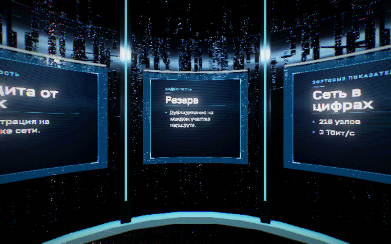
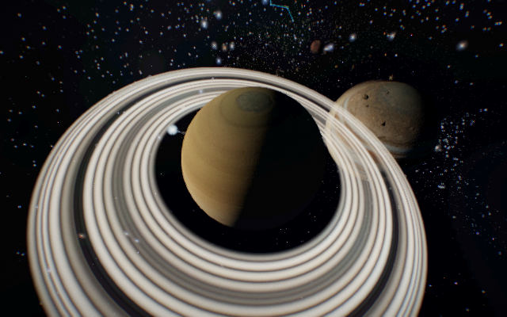

# Rocket r8: чёткость панелей и повторная сборка полёта

## Исправления

1. **Текст на стеновых панелях CDN.** Повторение текстуры и mipmaps заставляли Three/WebGL 1 уменьшать размеры холста, не являющиеся степенью двойки: 784×704 превращались в 512×512. Отражению текста достаточно координаты `1-u`. Для WebGL 1 теперь используются clamp, линейный фильтр и исходное разрешение; WebGL 2 сохраняет mipmaps. Кэш учитывает тип графического контекста. Настройки не меняют содержание карточек.
2. **Повторная сборка игры.** Старый проектор оставался в переменной `proj`; ранний выход из `projBuild` мешал присоединению новой камеры к новой сцене. При завершении мира очищаются принадлежащие ему ссылки на проектор, кабину и стеновую панель. Нативная повторная сборка подтверждает новую камеру внутри новой сцены.
3. **Освобождение графических ресурсов.** Завершение полёта теперь освобождает его композер. Сам композер освобождает три полноэкранные геометрии и очищает `lastPost`. Повторный вызов `dispose` безопасен.
4. Загрузчик CDN получил метку r8, чтобы браузер загрузил обновлённые модули.

Правила текстур WebGL 1: [Khronos](https://wikis.khronos.org/webgl/WebGL_and_OpenGL_Differences). Поведение с уменьшением разрешения воспроизведено настоящим нативным WebGL 1 до исправления; в новых кадрах предупреждения об уменьшении стеновых дисплеев отсутствуют.

## Проверка графики без браузерного WebGL

`review/native-flight.cjs` загружает оригинальные Three, построение мира, материалы, планеты, кабину и функции камеры. Временная инструментальная обёртка открывает закрытые функции только в памяти локального стенда; производственный код этим способом не изменяется.

| Размер | Точки | Результат |
|---|---:|---|
| 640×400 | 23 | 0 ошибок GL, шейдеров и некорректных трансформаций |
| 390×844 | 23 | 0 ошибок GL, шейдеров и некорректных трансформаций |

В каждом формате: передняя стенка, семь карточек, консоль; Земля, Луна, Меркурий, Венера, Марс, Юпитер, Сатурн, Уран, Нептун, Солнце, чёрная дыра, участок прыжка, возвращение; затем повторная сборка мира. Для снимков сохранены SHA256, камера, ресурсы и хеши исходных модулей. Во всех кадрах есть изображение. После пересборки камера заменена и присоединена к новой сцене.





Файлы находятся в `review/native-flight-r8/desktop/` и `review/native-flight-r8/portrait/`. Предыдущие 72 точки мира VPN сохранены в `review/native-world-r7/`.

### Границы результата

Это выбранные кадры оригинального 3D-кода. Между точками выполняются функции движения с модельным временем; промежуточные изображения не рисуются. Стенд использует фиксированные значения поворота рубки и маршрута, запасные записи карточек и собственный адаптер загрузки Canvas/изображений. Функция управления прокруткой CDN и HTML-контент страницы здесь не проверяются.

Шрифтовые файлы сайта разделены на латиницу и кириллицу через CSS unicode-range. Нативный Skia не применяет этот CSS, поэтому стенд регистрирует два имени и цепочку подстановки. Первоначальные пустые символы в стенде были ошибкой адаптера; это не исправление сайта.

Производственная приборная панель, кнопки и HUD игры рисуются HTML/CSS. Они исключены из этих PNG. Доступный браузер по-прежнему не запускает WebGL; отдельно в нём проверены раскрытие полного текста карточки, переключение на седьмую карточку и выход из сообщения о недоступном полёте на сайт.

На нативных кадрах заметны мелкие яркие блики обшивки и ограниченная читаемость перспективного текста при малом размере кадра. Эти кадры **не являются подтверждением идеального визуала**. Нужна дальнейшая сверка материалов и композитинга с браузерным изображением, включая WebGL 2/HDR. Нативный путь не заменяет проверку сенсорного управления, непрерывной прокрутки, звука и FPS на физических устройствах. Сходство с Igloo 1:1, фотореализм и 8K этим выпуском не подтверждаются.

Среда: Node 24, `gl@8.1.6`, `@napi-rs/canvas@0.1.80`, Linux с доступным X display. Пример:

```sh
ROCKET_GL_DEBUG=1 node review/native-flight.cjs rocketcdn /tmp/rocket-flight 390 844 all
```

## Проверки логики и выпуска

Обе новые регрессионные проверки воспроизвели дефекты r7 до изменения кода. После исправления прошли 48 проверок JavaScript, 13 изолированных API-проверок, 12 проверок хранилища и 7 проверок доставки. Межпроцессная блокировка в PHP.wasm пропущена; её нативная проверка относится к ранее опубликованному серверному выпуску. PHP-код в r8 не меняется.

10 проверок подготовки/переноса прошли, включая 6 проверок ограниченного переноса в исходную Rocket-ветку. Манифест контролирует 22 производственных файла, из них относительно r7 изменены 4. Удалений в списке переноса нет.

## Публикация

r8 опубликован 8 сентября 2026. Активный каталог `/var/www/rocket-releases/20260908-r8`; предыдущий r7 сохранён. Все **28/28** серверных проверок прошли; все пять существовавших заявок сохранены. Браузер подтвердил метку `rc-gl.js?v=20260908r8`. Подробности в `review/r8-verification.json`.

Адреса: [VPN](https://rocketvpn.top/), [CDN](https://rocketcdn.ru/), [полёт](https://rocketcdn.ru/?flight=1), [общая панель](https://rocketcdn.ru/admin.html).

## Репозиторий

r7 сохранён в подключённом GitHub коммитом `6df75ec187d543c3556fe6726681f9907b415314`; дерево совпало с авторизованным локальным снимком. r8 продолжает ту же отдельную ветку выпуска. Её нельзя сливать целиком поверх общего монорепозитория: для переноса используется ограниченный список `deploy/rocket-overlay.json`. Другие проекты, исходная Rocket-ветка и `main` не изменялись.
